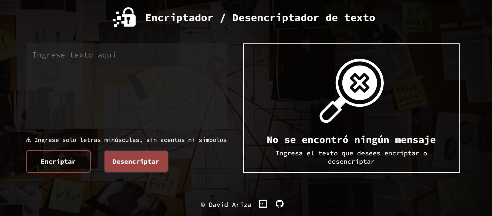

# Challenge encriptador / desencriptador de texto



## Descripción
Se trata de una página web que permite encriptar y desencriptar de manera simple el texto que ingrese el usuario. Un proyecto simple que permite practicar el uso de HTML, CSS y Javascript.

## Funcionamiento
### Llaves de encriptación
Las "llaves" de encriptación que utilizaremos son las siguientes:
```
La letra "e" es convertida para "enter"
La letra "i" es convertida para "imes"
La letra "a" es convertida para "ai"
La letra "o" es convertida para "ober"
La letra "u" es convertida para "ufat"
```
### Requisitos
- Debe funcionar solo con letras minúsculas
- No deben ser utilizados letras con acentos ni caracteres especiales
- Debe ser posible convertir una palabra para la versión encriptada también devolver una palabra encriptada para su versión original.

Por ejemplo:
```
"gato" => "gaitober"
gaitober" => "gato"
```


